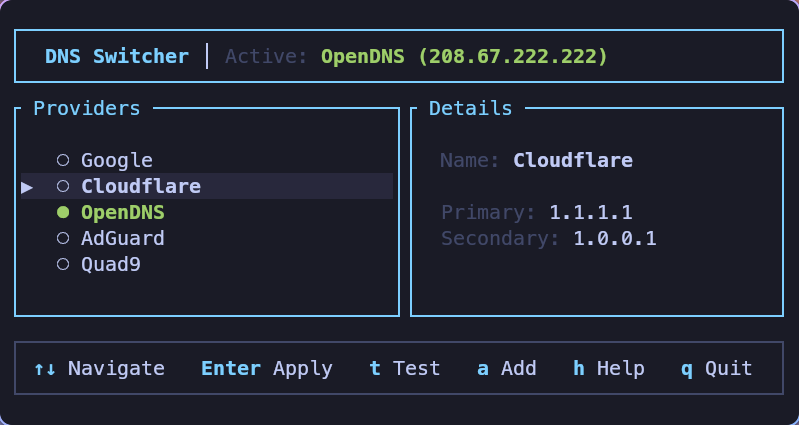
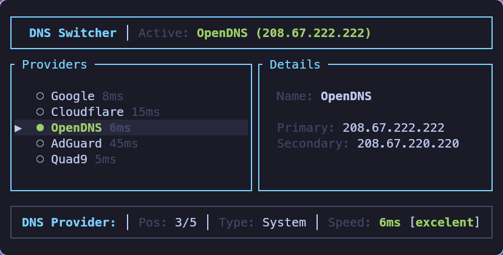

# dns-switcher

dns-switcher is a lightweight terminal user interface (TUI) for Arch Linux and other Linux distributions, designed to facilitate rapid switching between different DNS providers. It simplifies the process of changing system DNS settings by providing a clean, responsive interface for selecting both built-in and custom DNS servers.

The application is built with Rust and features a high-performance, asynchronous architecture.

## Features

- Provider Management: Quick selection from a list of popular DNS providers (Cloudflare, Google, Quad9, etc.).
- Custom DNS: Ability to add and persist your own custom DNS server configurations.
- Latency Testing: Real-time speed testing to identify the most responsive DNS provider for your current location.
- Automatic Detection: Identifies and displays the currently active system DNS.
- Adaptive Interface: Responsive design that adjusts its layout for different terminal sizes and heights.
- Resource Efficient: Optimized binary with a small memory footprint.
- Reactive Rendering: Utilizes an event-driven loop that only redraws the UI when necessary, resulting in nearly 0% CPU usage when idle.
- Stealth Mode: Optional `--no-help` flag to hide the footer help menu for a more minimalist experience.

## Screenshots





## Technical Improvements

Starting from version 0.2.1, dns-switcher has been migrated to an asynchronous event loop using Tokio. This migration ensures that the application remains completely idle while waiting for user input or background tasks, drastically reducing its impact on system resources compared to traditional polling-based TUI applications.

## Requirements

- Linux: The tool is designed for Linux-based systems.
- NetworkManager or Resolvconf: The tool requires system-level permissions or standard backends to modify DNS settings.

## Installation

### AUR (Arch Linux)
The package is available in the Arch User Repository:
```bash
yay -S dns-switcher
```

### Cargo
Install directly from crates.io using the Rust toolchain:
```bash
cargo install dns-switcher
```

### Installation via Script (curl)
You can install the latest version of dns-switcher directly using this script. It handles cloning, building, and installing the binary to your local path.

```bash
curl -sSL https://raw.githubusercontent.com/IovAnto/dns-switcher/main/install.sh | bash
```

## Usage

Launch the application with root privileges if your system requires them to modify DNS settings:
```bash
dns-switcher
```

### Options
- `--no-help`: Starts the application without the help footer, providing more vertical space for the provider list.

### Keybindings
- Arrows / j, k: Navigate the provider list.
- Enter: Apply the selected DNS settings.
- t: Run a latency test for all providers.
- a: Add a custom DNS provider.
- d: Delete a custom provider.
- r: Reset to system/ISP default DNS.
- h: Toggle the help menu.
- q / Esc: Exit the application.

## License

This project is licensed under the MIT License. See the LICENSE file for more information.
